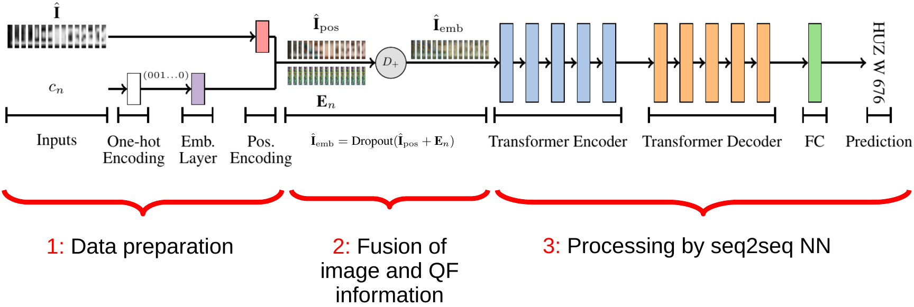

# Forensic License Plate Recognition with Compression-Informed Transformers
If you use this code for your research, please cite our paper accepted at ICIP 2022 and previously available [here](https://faui1-files.cs.fau.de/public/publications/mmsec/2022-Moussa-FLPR.pdf) .



## Pretrained Models
[Here](https://faui1-files.cs.fau.de/public/mmsec/moussa/2022-ICIP-trained-models/) you can download our pretrained pytorch models for our experiments specified in the [paper](https://faui1-files.cs.fau.de/public/publications/mmsec/2022-Moussa-FLPR.pdf).

## Getting started

### Prerequisites
1. Download the synthetic license plate dataset from [here](https://faui1-files.cs.fau.de/public/mmsec/datasets/SynthGLP/) into the `data` folder. If you store it in some other location you need to adapt the paths in the given JSON configuration files used for training/inferencing.
2. Install [conda](https://docs.conda.io/en/latest/miniconda.html) and create the `icip2022` environment with *environment.yml*
```bash
$ conda env create -f environment.yml
$ conda activate icip2022
```

### Model Training
Example:
```bash
$ PYTHONPATH='pwd' python train.py json_configs/train_config.json
```
The provided config file belongs to our `LP-Transf.-100` model in the [paper](https://faui1-files.cs.fau.de/public/publications/mmsec/2022-Moussa-FLPR.pdf).
To change the model configuration, adapt the config file. Some relevant parameters:

<pre>
<b>device:</b> Hardware device to train on, e.g. "cuda:0" <i>(string)</i>
<b>model_weights:</b> path to .pth file with model weights to load  (loads no weights if not specified) <i>(string)</i>
<b>print_batch:</b> whether to print train/validation batch to console <i>(bool)</i>
<b>log_interval:</b> log batch loss all n steps + print batch to console if print_batch=true <i>(int)</i>
<b>tensorboard_log:</b> whether to enable tensorboard event logs <i>(bool)</i>
<b>knowledge_embedding:</b> whether to enable the embedding of compression quality factors <i>(bool)</i>
<b>num_degradation_classes</b>: Granularity of knowledge classes, we used [5,10,20,50,100] in our paper <i>(int)</i>
<b>train_data_dir:</b> path to training data split <i>(string)</i>
<b>valid_data_dir:</b> path to validation data split <i>(string)</i>
<b>output_model_dir:</b> path to output folder <i>(string)</i>
<b>aug_params</b>: contains parameters for degradations computed on the fly <i>(misc)</i>
</pre>
The `TrainConfig` class in `helpers/config.py` defines all supported configuration parameters.

The training routine creates the directory specified in the config via `output_model_dir`. It contains:
1. a `runs` folder with tensorboard log files (if tensorboard logging is enabled)
2. `log.txt` which logs the batch loss and will be updated all `log_interval` steps
3. a copy of the model's config `config.json`
4. a `saving` folder with model checkpoints, one for every trained epoch

### Evaluate Model
1. Inference the model and save the predictions.

Example: 
```bash
$ PYTHONPATH='pwd' python inference.py json_configs/inference_config.json
```
The config file is similar to the one used for training.
All supported configuration parameters are specified in `helpers/config.py` in the `TestConfig` class.
To load the previously trained model, specify the path to the checkpoint in **model_weights**. 

You can also use our [trained models](https://faui1-files.cs.fau.de/public/mmsec/moussa/2022-ICIP-trained-models/) from the paper.
To use one model, create some directory `<model_dir>` and a sub-directory `<saving>` in which you save the checkpoint. 
Set **model_weights** in `inference_config.json` accordingly.

The `inference.py` script searches for the `config.json` file in `<model_dir>` to construct the model graph with the correct parameters. You can reuse the provided `train_config.json` file.
Copy it to `<model_dir>`, don't forget to rename it to `config.json` and adapt **num_degradation_classes** to the correct dimension (5,10,25 or 50). For the LP-Transf. model, set **knowledge_embedding** to false.
All other model specific parameters (such as number of encoder/decoder layers, etc.) stay identical.
You may need to adapt the paths in the `config.json` file.


While the script is running, the predictions will be continuously written to a CSV file in the
**output_dir** folder specified in `inference_config.json`.


2. Run `evaluate.py` to compute the performance metrics.

Example:

```bash
$ PYTHONPATH='pwd' python evaluate.py saved_models/model/predictions
```
`saved_models/model/predictions` is the directory in which the CSV file(s) with the model's predictions is/are stored.
The script computes the accuracy and character error rate for each prediction file in the directory. The metrics' results are stored in the directory `saved_models/model/predictions/results`
which is automatically created as subdirectory.
